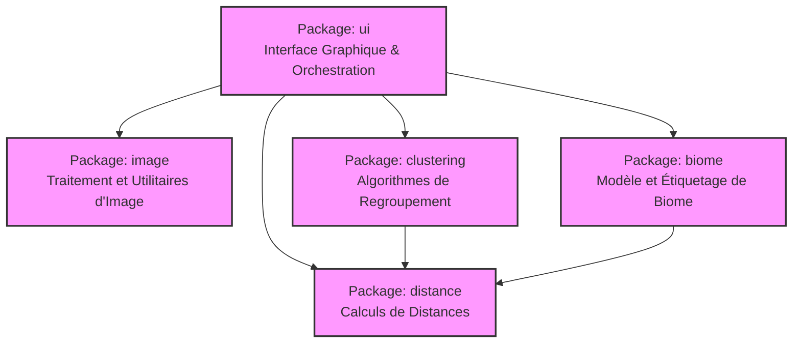
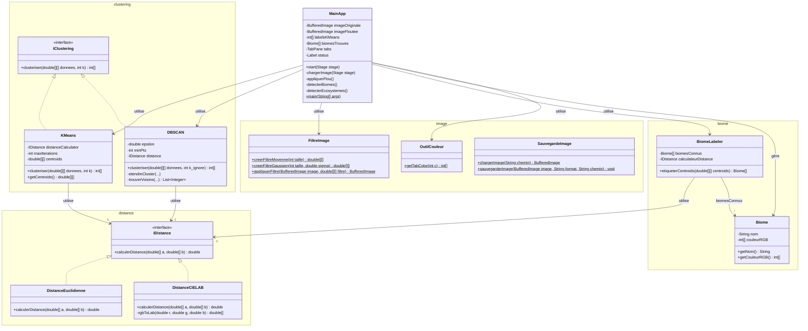
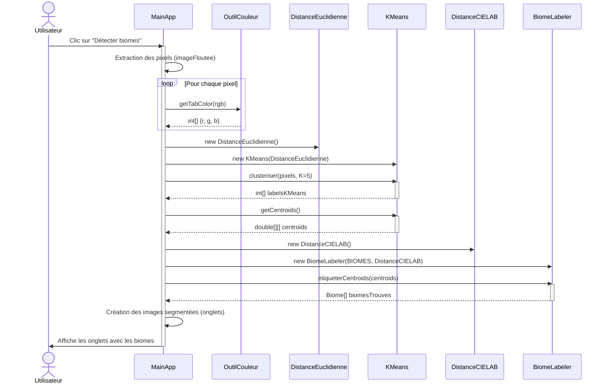
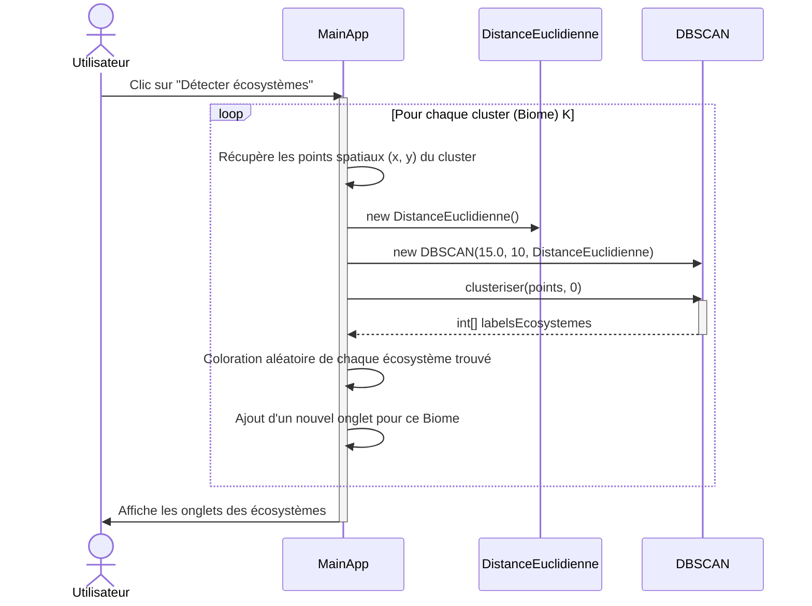

# Diagrammes du Projet

## 1. Diagramme d'Architecture

Les différents modules (packages) du projet et leurs dépendances. L'interface utilisateur (`ui`) orchestre les autres modules pour le traitement d'image, le clustering et la classification des biomes.

## 2. Diagramme de Classe

## 3. Diagrammes de Séquence

### A. Flux de détection des Biomes (`detecterBiomes`)

Lorsque l'utilisateur clique sur le bouton "Détecter biomes".

### B. Flux de détection des Écosystèmes (`detecterEcosystemes`)

Interactions pour la sous-segmentation spatiale des clusters (écosystèmes).

