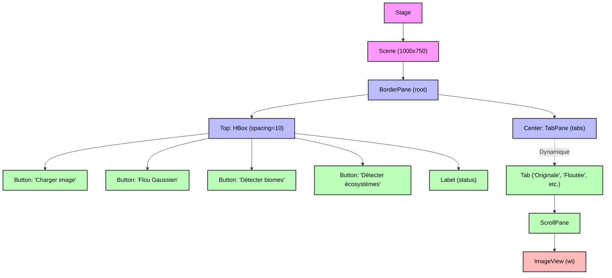

# Graphe de Scène de MainApp

```mermaid
graph TD
    Stage["Stage"] --> Scene["Scene (1000x750)"]
    Scene --> Root["BorderPane (root)"]
    
    Root --> Top["Top: HBox (spacing=10)"]
    Top --> BtnCharger["Button: 'Charger image'"]
    Top --> BtnFlou["Button: 'Flou Gaussien'"]
    Top --> BtnBiomes["Button: 'Détecter biomes'"]
    Top --> BtnEcosystemes["Button: 'Détecter écosystèmes'"]
    Top --> StatusLabel["Label (status)"]
    
    Root --> Center["Center: TabPane (tabs)"]
    Center -. "Dynamique" .-> Tab["Tab ('Originale', 'Floutée', etc.)"]
    Tab --> ScrollPane["ScrollPane"]
    ScrollPane --> ImageView["ImageView (wi)"]
    
    classDef stage fill:#f9f,stroke:#333,stroke-width:2px,color:#000;
    classDef layout fill:#bbf,stroke:#333,stroke-width:2px,color:#000;
    classDef control fill:#bfb,stroke:#333,stroke-width:2px,color:#000;
    classDef image fill:#fbb,stroke:#333,stroke-width:2px,color:#000;
    
    class Stage,Scene stage;
    class Root,Top,Center layout;
    class BtnCharger,BtnFlou,BtnBiomes,BtnEcosystemes,StatusLabel,Tab,ScrollPane control;
    class ImageView image;
```
